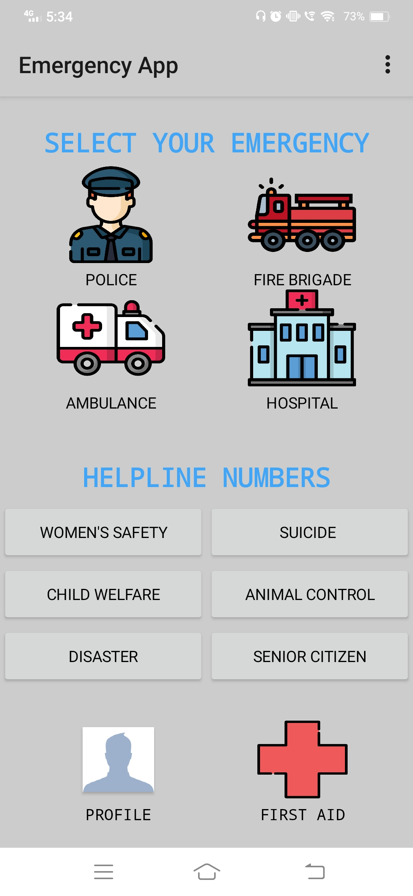
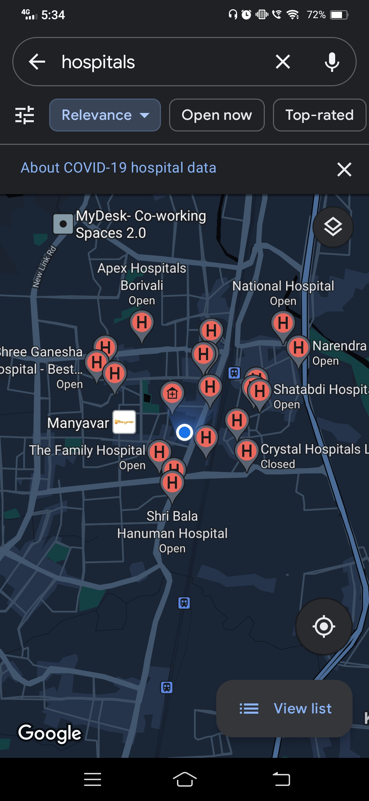
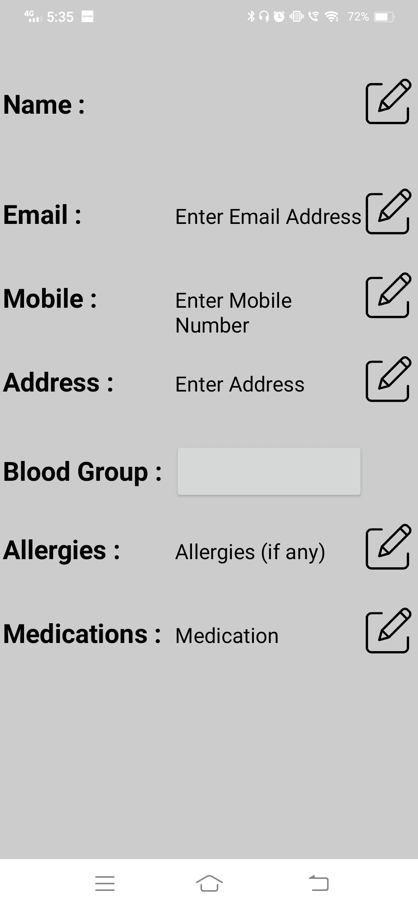
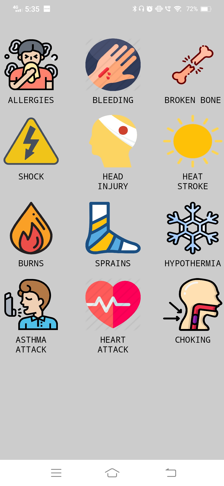
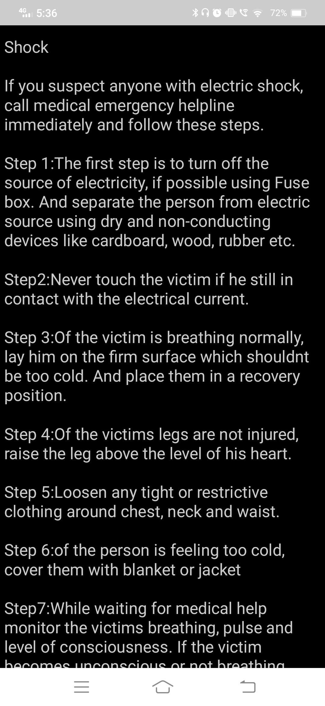

# Emergency Service App 🆘

## <a name="system">About the App</a>

**Emergency Service App** prototype was created using MIT App Inventor where using the user's current location they get contacts of nearby hospitals, fire brigade and police station incase of an emergency. It also provides with all the helpline numbers and lets the user call directly while accessing the app. Lastly, it has all the first aid details user requires in an emergency.

---

## <a name="Results">Results</a>

<table style="width:1680px; border: black; margin: 0px auto;" class="skinny" cellspacing="0" cellpadding="0">
    <tr>
        <th>Home Page</th>
        <th>Location Wise Service</th>
    </tr> 
    <tr>
        <td>
            
        </td>
        <td>
            
        </td>
    </tr>
    <tr>
        <th>Helpline Service</th>
        <th>Profile Page</th>
    </tr> 
    <tr>
        <td>
            
        </td>
        <td>
            
        </td>
    </tr> 
    <tr>
        <th>First Aid</th>
        <th>Detailed First Aid</th>
    </tr> 
    <tr>
        <td>
            
        </td>
        <td>
            
        </td>
    </tr> 
</table>

---
